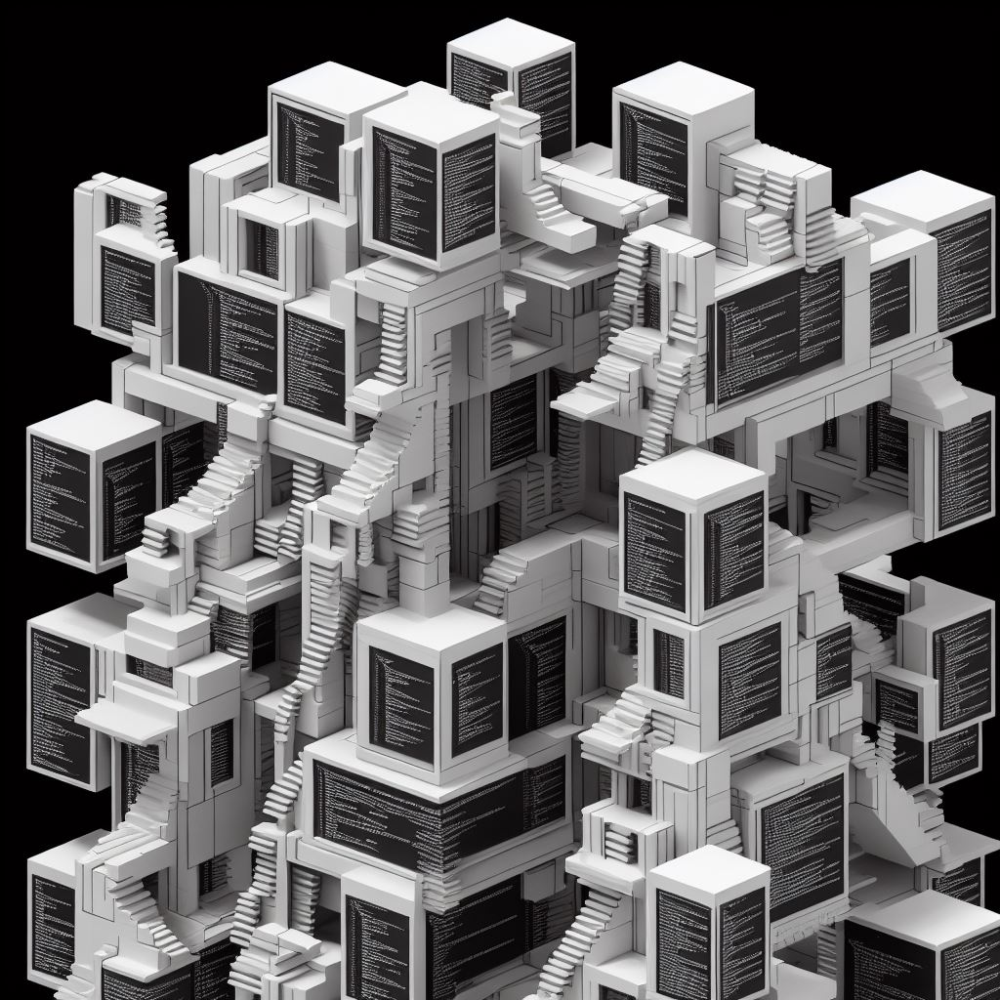

<!---
Title: About .NetBlocks
NavigationTitle: About
ShowInNavigation: True
ShowInSidebar: false
NoSidebar: false
Excerpt: About .Net Blocks.
--->

{width=200 height=200}

> _.NetBlocks architecture - A Micro Subsystem Architecture pattern and a solution of solution building blocks -
>the advantages of micro-services without the code-splaining_
>
>_Easy to use, easy to build, easy to scale and easy to maintain._

### DotNetBlocks Architecture and Point Solutions

# What is it?

.Net blocks is a one-stop solution and architecture to solve all your point problems and build large scalable event and api powered enterprise applications. It consists of an opinionated, ready to use design and archicture, and all the components needed to get your started.

We accelerate you out of the gate.

- An opinionated library, architecture and design
- accelerates development time for large scalable enterprise level systems
- keeps you focused on solving business problems, not tech ones.

## *Note from the originator.*

_> "After years of developing large scalable enterprise systems, you notice that the same patterns keep repeating
 and you are solving the same problems again and again and while everything appears to be new, its really history on repeat._

_> When you build the same blocks again and again as you solve problems for others and make systems scalable, you realize someone needs to build blocks that set the patterns, architecture and help others build enterprise systems quickly._

>
_> To help everyone, I founded the .NetCollective and started this project - .NetBlocks. Hope you join the movement. B."_
>
_> ... Brian Rogers founder_

[Interested in the Design philosophy?](/Design)

[Let's get started?](Get.started.html)

### Terms, Licensing, Contributing, Open Source code, 

### Additional Links

Links to  source, licensing and the project.

 [GitHub Src](https://github.com/dotnetCollective/dotnetBlocks)

[Project root](http://dotnetblocks.dotnetcollective.org/)

[Licensing](https://github.com/dotnetCollective/dotnetBlocks#MS-PL-1-ov-file)

## More Content

\@Html.Partial("_ChildPages",Document)

